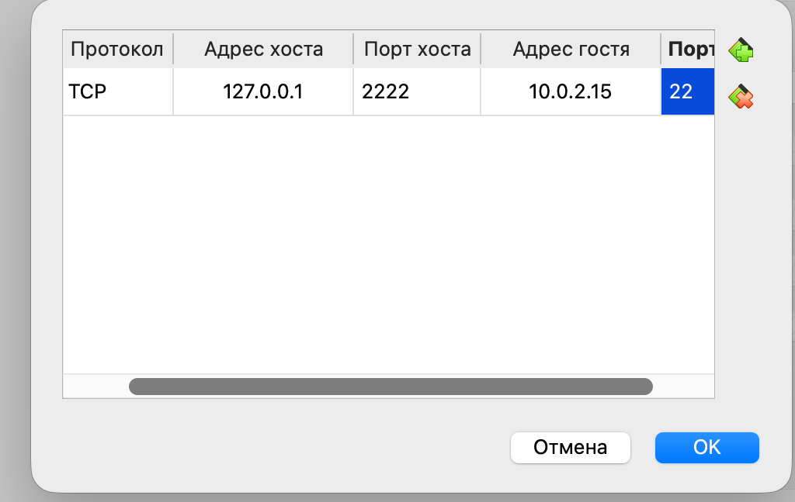
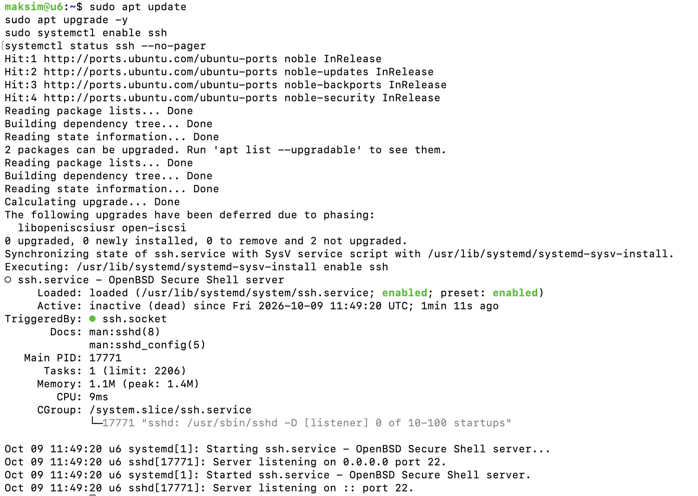
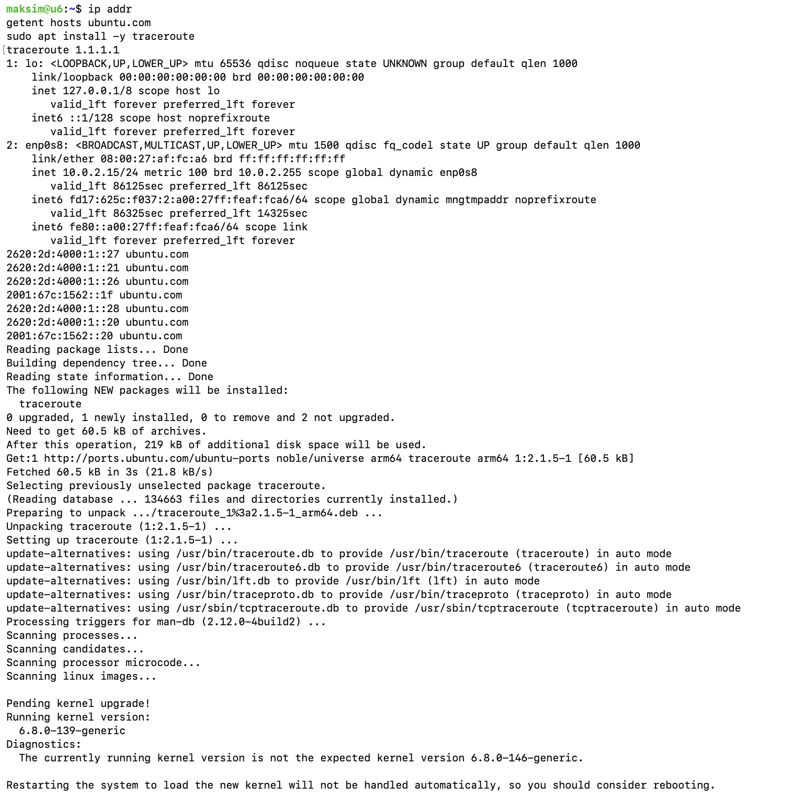
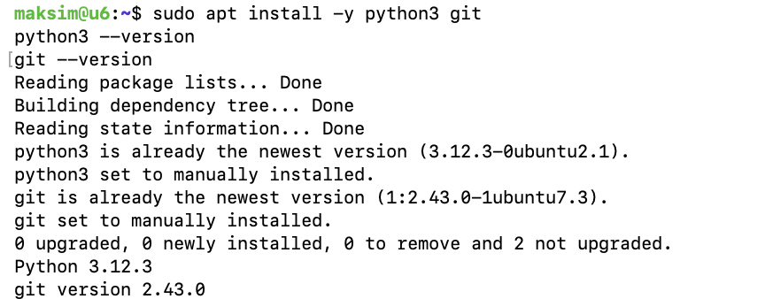
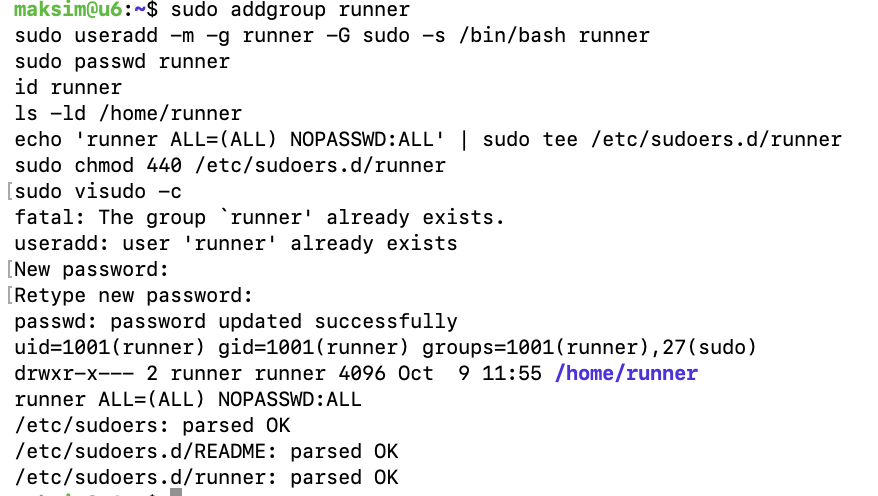
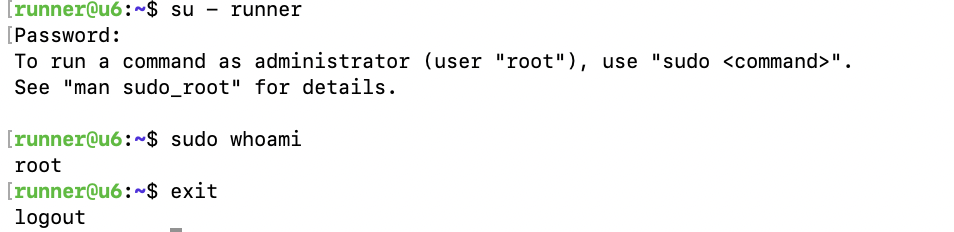
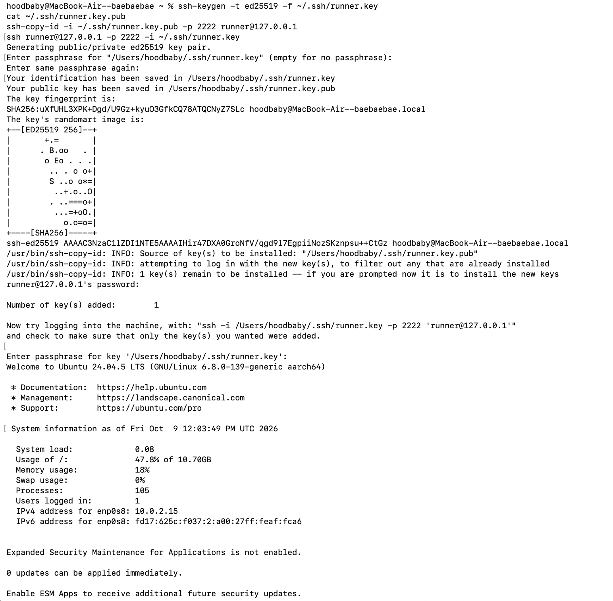
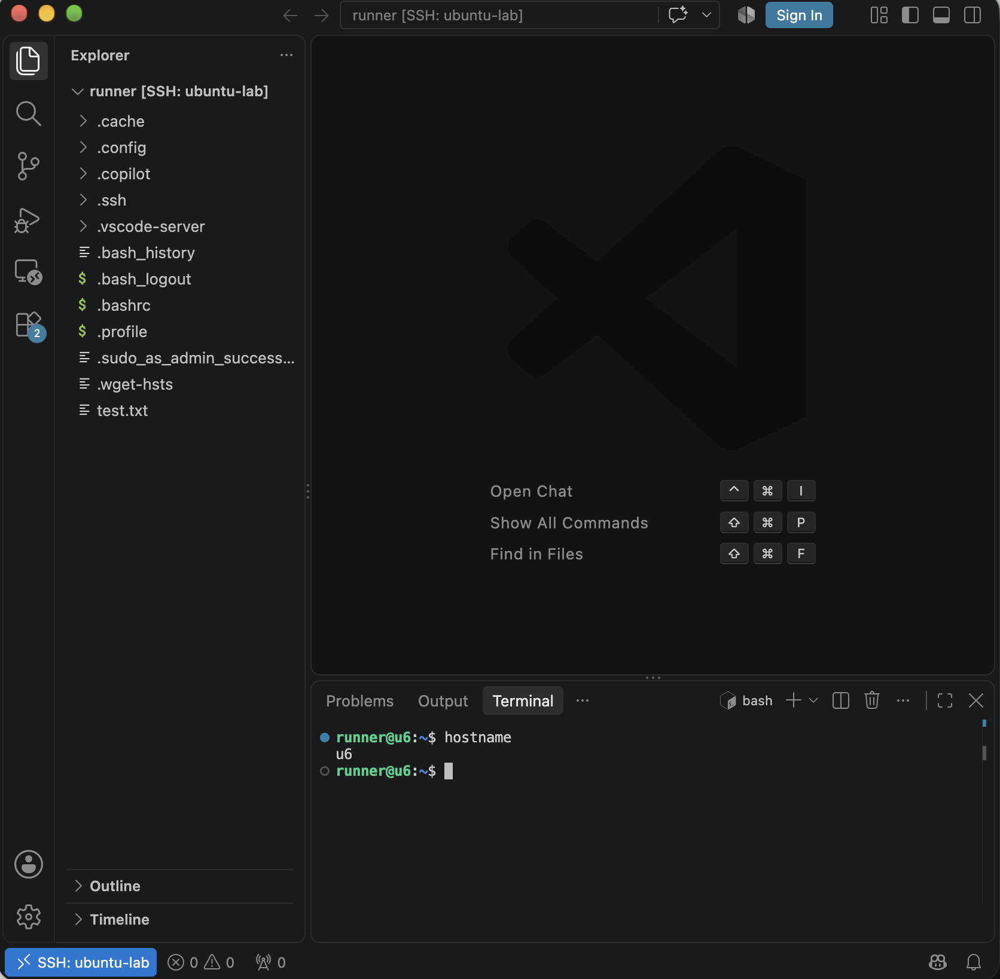

# Лабораторная П01. Базовое администрирование Linux

## Окружение
- Хост: MacBook на Apple Silicon (M2), macOS
- Гипервизор: VirtualBox
- Гость: Ubuntu Server 24.04.5 LTS (arm64), hostname `u6`
- Сеть: NAT, проброс порта `127.0.0.1:2222 → 10.0.2.15:22` (порт 22 на хосте macOS занят собственным SSH)

## 1. Настройка сети и проброс порта
В настройках VM адаптер переведён в режим NAT и добавлено правило проброса портов: TCP, порт хоста 2222, порт гостя 22. Это позволяет подключаться к VM по SSH с хостовой системы.

## 2. Обновление системы, SSH-сервер и DNS
SSH-сервер установлен вместе с системой. Изначально служба была в состоянии `disabled`, поэтому добавил её в автозагрузку командой `sudo systemctl enable ssh`. На скриншоте видно `enabled` и `active (running)`.

Обнаружил проблему: DNS не работал (`Temporary failure resolving`), хотя доступ по IP был (`curl http://1.1.1.1` вернул 301). Исправил через netplan (`/etc/netplan/50-cloud-init.yaml`): отключил DNS от DHCP и прописал `1.1.1.1` и `8.8.8.8`. После `sudo netplan apply` имена стали резолвиться и `apt update` прошёл успешно. Обычный `ping` не проходит из-за ограничений ICMP в VirtualBox NAT, поэтому связь проверена через DNS и `apt update`.

## 3. Диагностика системы
Выполнены команды для проверки состояния системы:
- `uname -a` показывает версию ядра и архитектуру (aarch64);
- `lsb_release -a` показывает версию дистрибутива (Ubuntu 24.04.5 LTS);
- `lsblk` и `fdisk -l` показывают диски и разделы (виртуальный диск 25 ГБ, LVM);
- `mount`, `ls -la`, `top` показывают точки монтирования, содержимое каталога и загрузку процессов.

Права доступа проверены на тестовом файле: `chmod 640` задаёт права чтения и записи владельцу и чтения группе, `chown root:root` меняет владельца и группу.

## 4. Диагностика сети
`ip addr` показывает, что интерфейс `enp0s8` получил адрес `10.0.2.15/24` по DHCP. Имя интерфейса отличается от `enp0s3` у преподавателя из-за архитектуры ARM. `traceroute` показывает маршрут до `1.1.1.1`. Часть узлов отображается как `* * *`, так как NAT VirtualBox не пропускает такие пакеты.

## 5. Установка пакетов
Установлены `python3` и `git` через `apt`. Версии проверены командами `python3 --version` и `git --version`.

## 6. Создание пользователя runner
Создана группа `runner` и пользователь `runner` с домашним каталогом (`-m`), оболочкой `/bin/bash` и членством в группе `sudo`. Пароль задан через `passwd`. Команда `id runner` показывает группы пользователя, `ls -ld /home/runner` подтверждает наличие домашнего каталога. SSH-доступ разрешён по умолчанию (ограничений `AllowUsers` нет).

## 7. Sudo без пароля
Правило `runner ALL=(ALL) NOPASSWD:ALL` добавлено в отдельный файл `/etc/sudoers.d/runner` с правами 440, а не в основной `/etc/sudoers`, так безопаснее. Корректность проверена `visudo -c`. После входа под `runner` команда `sudo whoami` вывела `root` без запроса пароля.

## 8. Вход по SSH-ключу
На хосте сгенерирована пара ключей `ssh-keygen -t ed25519 -f ~/.ssh/runner.key`. Публичный ключ передан на VM командой `ssh-copy-id` и попал в `~/.ssh/authorized_keys` пользователя `runner`. Подключение выполнено командой `ssh runner@127.0.0.1 -p 2222 -i ~/.ssh/runner.key`: запрашивается только passphrase ключа, а не пароль пользователя. Приватный ключ в репозиторий не добавлен.

## 9. Подключение из VS Code
Установлено расширение Remote - SSH. В `~/.ssh/config` добавлен профиль `ubuntu-lab` (HostName 127.0.0.1, Port 2222, User runner, IdentityFile ~/.ssh/runner.key). VS Code подключился к VM, в левом нижнем углу отображается `SSH: ubuntu-lab`, открыт домашний каталог `/home/runner`.

## Выводы
Развёрнута VM с Ubuntu Server 24.04, настроены SSH-доступ по паролю и по ключу, создан пользователь с sudo без пароля, выполнена диагностика системы и сети, настроено удалённое редактирование через VS Code.
